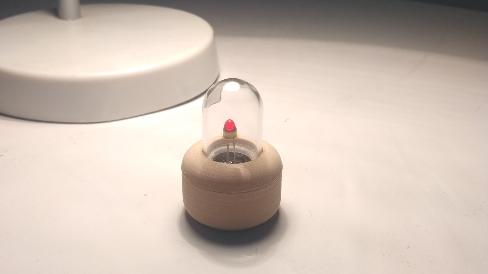

# LED Pedestal

This repository contains hardware, firmware and
3D-printable case for the LED Pedestal project.

## What is this project?

The name says it all - it's just a fancy-looking circuit
that can blink your precious (retro or not) LED that you probably
still keep at the bottom of your component drawer. The circuit is heavily
over-complicated and the same thing could be done using 3 or 4 components total,
but it looks cool and has some nice features:

- PIC10F222 micro controller with sophisticated firmware (as far as 512 bytes 
firmware written in C with some assembly can be)
- Whole 3 (three!) randomly-parameterized LED effects to select from 
- Micro USB for charging the Li-Ion battery with all the (unnecessary)
protection circuits (overcharge, over-discharge and short-circuit protection) 
- small button for checking battery level and changing LED Blinking modes
- reaction to connecting charger and showing charging status
- can work while charging from USB

And on top of that, cool-looking glass dome case 
to encapsulate the spirit of your LED!

## How do I make my own?

Before you start you have to:

- be able to solder small SMD components (TSSOP-8 is the smallest-pitch used in
the design) and use hot-air or hot plate (or frying pan) to solder
micro USB port (you could try to use soldering iron but it will be much more 
tedious) 
- be able to program PIC10F222 micro controller (even cheap PICKit2 can be used)
- calculate current-limiting resistor for your LED assuming 3.3V drive voltage,
voltage drop and recommended current from LED datasheet. You can calculate it
using the following formula: `R = (V_battery - V_LEDdrop) / I_LED` or just slam
68 Ohm one and call it a day 

You can use available [gerber zip](hardware/gerbers_v2.zip) archive and order
the PCB from your favorite (or the cheapest) PCB manufacturer and buy the 
necessary components listed in the Bill of materials (most of them should be
cheap and easy to obtain even from places like AliExpress).

Bill of materials can be found [here.](bom.txt)

#### Assembly of the PCB

If you are soldering the PCB by hand, begin with USB port and the button 
Jumper from middle pad to pad marked with an arrow is variant with Random 
Seed Generator (Not implemented) and the jumper from middle pad to the 
third one (the one without arrow mark) is variant with battery 
measurement - connected by default in revision 2 of PCB, so if by any chance
you uploaded `gerbers_v1` instead of `gerbers_v2` you will have to solder it.
If your precious LED still has long legs don't cut them and instead solder it to
be as high above the PCB as possible! Cathode is the square pad. After soldering
SMD components solder trough-hole JST socket or the Li-ion cell directly.

If for whatever reason don't want to use 
[SOICBite](https://github.com/SimonMerrett/SOICbite) you can solder wires to the
pads directly and connect it to the programmer or program the PIC before
soldering it. Connection diagram can be found in the schematic and programming 
pads description in `media` folder). Example programming jig:

After connecting the Li-Ion cell you have to connect it to the USB
to start the protection circuits (they go to fail-save mode if the battery was
disconnected) and you should have a nice and working pedestal!

#### Assembling the case

To assemble the case you will need following elements:

- three 3D-printed parts - STL files are in `case` folder. I recommend to print
them with some nice material and fine settings - they should look better than
your average print!
- eight round 2x2mm N35 magnets
- 12x18mm glass dome

You should be able to get those on AliExpress or similar sites. 
Glue 3D-printed ring to the bottom of glass dome and put the magnets
into the holes in such configuration that two case parts attract each 
other. then put the PCB and the battery into the bottom part, the glass dome
into the upper one and they should snap together. 

## Battery life
On 35mAh Li-ion 3.7V battery it should work:

- about 20 hours when in random blink mode
- about 15 hours when in both breathing modes
- much longer when in shutdown mode (PIC has to wake up every ~2 seconds just to
go to sleep again)

It mostly depends on the LED used as the firmware does everything it can
to preserve battery life.

## More pictures?

Gallery can be found in `media` folder if you like even more photos and videos
of this thingy.

## How do I use this?

If you click the button, the device will blink out it's status:

- if connected to charger
	- two short blinks means that it's charged
	- two slightly longer blinks means that its still charging
- if working from battery
	- from 6 to 2 blinks that indicate battery level - more blinks means more
	battery left
	- one short blink means battery is almost empty
	- no blinks means it's dead and you should connect it to USB

To change blinking mode, you have to press the button until LED will make a long
blink - that means it changed mode. If you don't release the button the 
mode will keep changing to next one on list bellow with each long blink. 

Implemented modes (whole four!):

- Random LED blink
- Sine-like LED breathing
- Linear LED breathing
- Power-off

### What else can/could be done:
The project is functional as-it-is but there is some room for improvements for
the software (hardware-wise it probably would be better to just connect it 
to Digispark and call it a day):

- Test other effects than RNG-BLINKENKIGHT, Quadwave and Triwave fading - simple
"test jig" can be found in `effects-workdir` folder.
- Try to rewrite current `quadwave` effect as it's not well suited 
for the PIC core
- Think of better effects that could be implemented given so little space

### Differences between PCB versions:

- change of some component values to reduce number of different resistor values
- more silkscreen markings on new PCB
- bigger pads on the button footprint (previous were hard to solder
  without hot plate) 
- the button is now closer to the PCB center - better fit with the case

## Author ramblings about the design

This whole project started because of the one small LED found in old lab
equipment and most of the decisions weren't really well-thought - after all
it wasn't meant to be some mass-produced product (if you want thing like that
you could just buy electronic candle) and, as always, only after the fact 
better ideas start popping in one's head. Bellow are some of them:

- Using other SOT-23 micro controller would probably allow for more effects and
slightly better battery life - for example PIC0F322 or Padauk PMS150C-U06 
or ATiny10, but I had access only to PIC10F222 so I used those. If someone would
want to port this firmware to other micro it should be possible - it's (almost)
C after all. I wanted to use SOT-23 as much as possible because it's small but
still fairly easy to solder, but there are many other options.
- Whole battery protection circuit could be ditched as even small Li-ion cell
come with one or at least change FS8205A to SOT-23 version that is smaller 
and easier to solder.
- Some elements around the button pin could be probably removed (they were there
because at design time it was undecided if this pedestal should work only 
on button press or the button would control the mode. Now those elements
function as over-complicated debouncing circuit. 
- author thought on the idea to make random seed generator based on
fluctuations of RC time constant where instead of resistor, a thermistor would
be used. But as it turned out, 16-bit LSFR was sufficient and showing battery
level seemed more useful in this useless device. If the capacitor will be
charged and pin function would be switched to ADC, the voltage level would
depend only on R value that is dependent on temperature. But on 8-bit fixed
sampling time ADC the variation wouldn't be too big(if any) so multiple readings
would be needed to extract any entropy from it.

## License
BSD 3-Clause